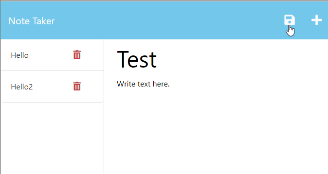

# note-taker
The note taker application helps organize thoughts and keep track of tasks.

## Technologies Used
* Node.js
* Express.js
* npm
* JavaScript
* HTML
* CSS

## Description
For this challenge the HTML, CSS, and JavaScript are already built out. The note taker is an application where I'm able to add tasks to stay organized. Each new task is saved into the database and can be retrieved by clicking on the saved note.

## Visual

## Installation
1. Clone the note-taker starter code:  
https://github.com/coding-boot-camp/miniature-eureka.git  
2. Add the server.js file.  
3. Add .gitignore file to ignore the node_modules.  
4. Add the helpers folder with the uuid.js file to help create unique id's for each new note.  
5. Install express package using the terminal, "npm install express".  

## Usage
Enter, "npm start" into the terminal to start the server. Enter, "ctrl + c" to turn off the server.

## Deployed Application Link
https://git.heroku.com/murmuring-basin-97362.git 

## Author & Acknowledgements
* https://github.com/thoak90codes
* UW Coding Bootcamp